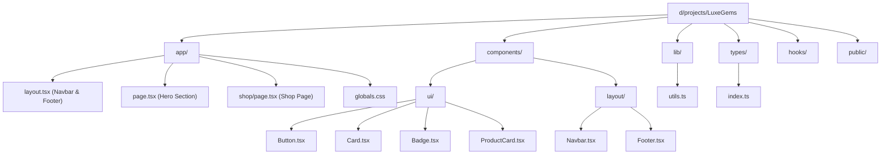
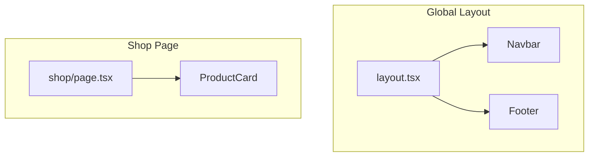
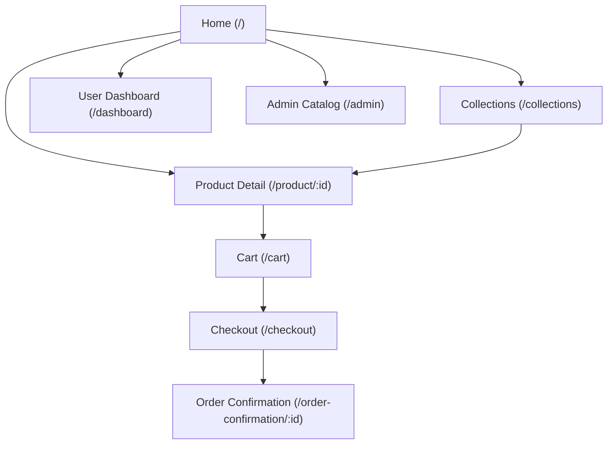
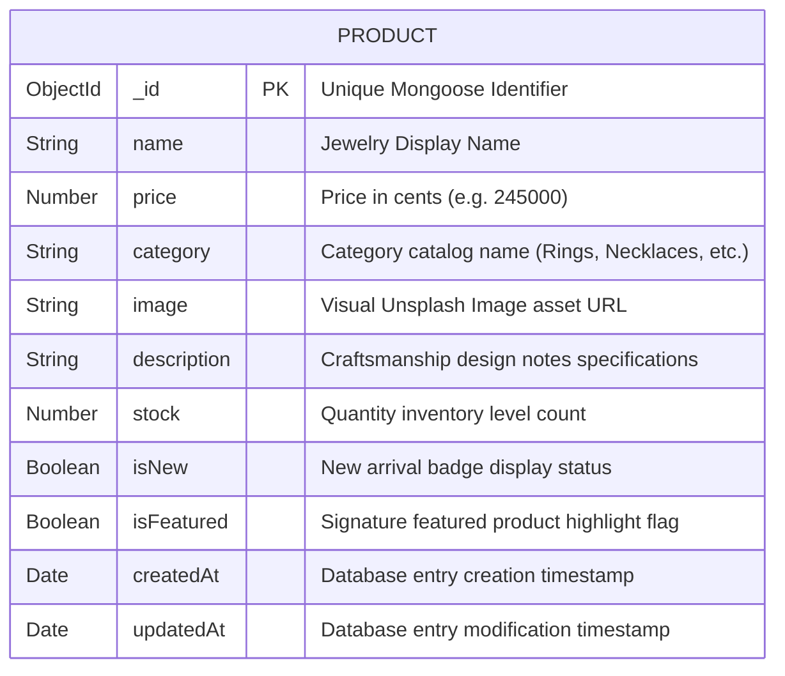
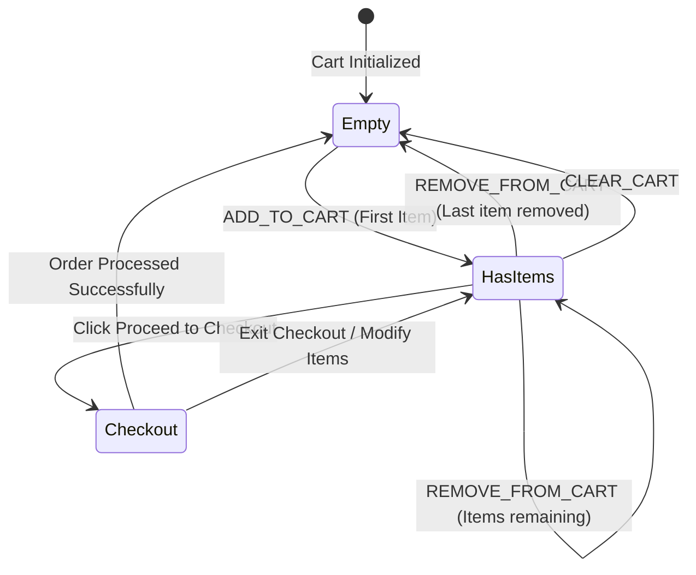
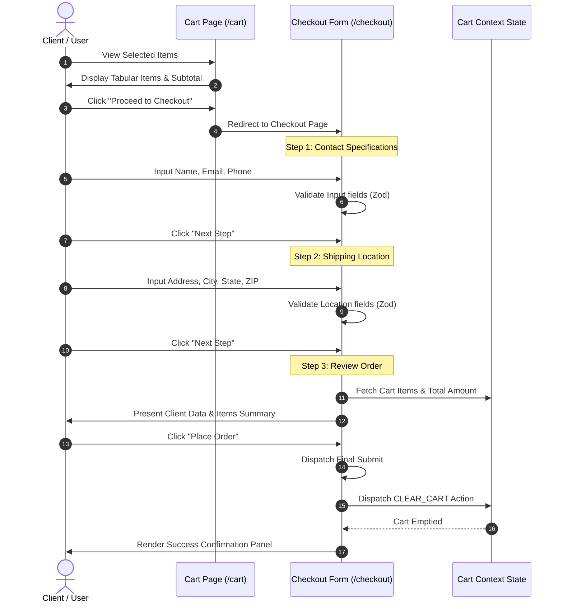
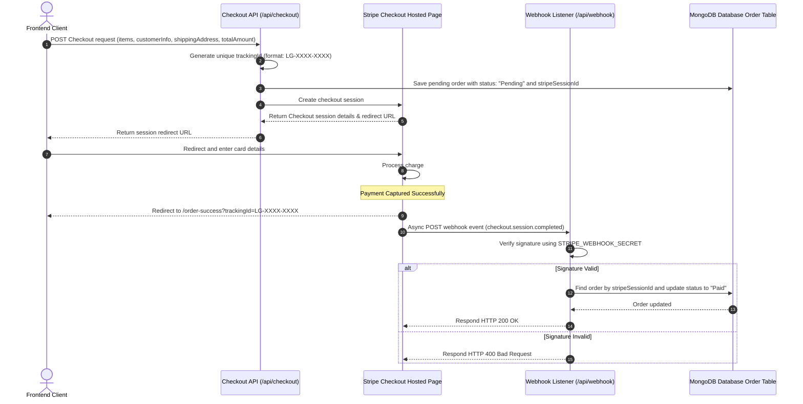

<!--
  📁 README.md
  📁 Main documentation for LuxeGems Store.
  ⚙️ Outlines setup steps, folder paths, routing flow, and project architecture.
-->

# LuxeGems Store

LuxeGems Store is a premium, full-stack jewelry e-commerce web application engineered with modern web standards to deliver an immersive, elegant, and secure shopping experience for high-end fine jewelry.

---

### Tech Stack Badges


---

### Current Status
**✅ Commit 1 — init: Project Scaffold, Folder Structure, Base Layout, and Documentation**
This phase establishes the structural blueprint, design styles, and global configuration of the application. No business logic or database connections are active yet.

**✅ Commit 2 — feat: add ProductCard component and static shop page**
This phase introduces the product visual catalog with a static `/shop` page grid gallery and the reusable atomic `ProductCard` component, as well as navbar active route highlights.

---

## Folder Structure Tree
```text
LuxeGems/
├── app/                  # Next.js App Router Pages and Layouts
│   ├── favicon.ico
│   ├── fonts/            # Local asset font binaries
│   ├── globals.css       # Core Tailwind CSS and base styles
│   ├── layout.tsx        # Global page wrapper with Navbar and Footer
│   ├── page.tsx          # Homepage containing the premium Hero section
│   ├── cart/             # Cart Pages
│   │   └── page.tsx      # Full cart page with tabular items summary
│   ├── checkout/         # Checkout Pages
│   │   └── page.tsx      # Multi-step checkout form layout
│   └── shop/             # Shop Pages
│       └── page.tsx      # Static shop gallery page with mock products
├── components/           # Reusable UI component layers
│   ├── layout/           # Global structural components
│   │   ├── Footer.tsx    # Global Footer links and newsletter area
│   │   └── Navbar.tsx    # Glassmorphism sticky Navbar
│   └── ui/               # Atomic components
│       ├── Badge.tsx     # Custom pill tags
│       ├── Button.tsx    # Customizable buttons with luxury gold styling
│       ├── Card.tsx      # Premium container panels
│       ├── FormField.tsx # Reusable labeled input field
│       └── ProductCard.tsx # Premium product card component
├── hooks/                # Custom React hooks (empty for now)
├── lib/                  # Shareable configurations and helper functions
│   └── utils.ts          # Utility functions (cn, formatPrice)
├── public/               # Static assets
├── types/                # TypeScript type structures and interfaces
│   └── index.ts          # Common types (Product, User, CartItem, Order)
├── .env                  # Local secrets and config variables (ignored by Git)
├── .env.example          # Documentation template for configuration
├── .gitignore            # Version control exclusions
├── package.json          # Dependency scripts
├── tsconfig.json         # TypeScript compiler configurations
```

---

## Project Folder Architecture


---

## Component Hierarchy Architecture


---

## Planned App Routes & Flowchart
This diagram outlines the target URL structure and user navigation pages planned for development:



## Product Schema Database ER Diagram
This diagram represents the structural database properties modeled for each catalog product:



---

## API Endpoints Reference
The backend exposes the following API routes for querying the catalog database, managing checkouts, and tracking orders:

| Method | Path | Query Parameters / Payload | Description | Response Status |
| :--- | :--- | :--- | :--- | :--- |
| **GET** | `/api/products` | `category` (optional filter)<br>`featured` (optional boolean) | Fetches a list of products from MongoDB filtered by criteria. | `200 OK` (list)<br>`500 Error` |
| **GET** | `/api/products/[id]` | None | Fetches detailed attributes for a single product. | `200 OK` (details)<br>`404 Not Found`<br>`500 Error` |
| **POST** | `/api/checkout` | JSON checkout payload (items, customerInfo, shippingAddress, totalAmount) | Creates a pending order and constructs a Stripe Checkout session. | `200 OK` (session URL)<br>`400 Bad Request`<br>`500 Error` |
| **POST** | `/api/webhook` | Raw Stripe signature headers and body payload | Receives asynchronous event callbacks from Stripe to update order status. | `200 OK` (processed)<br>`400 Invalid Signature`<br>`500 Server Error` |
| **GET** | `/api/orders/[trackingId]` | None | Retrieves customer order details, status, and shipping logs. | `200 OK` (order data)<br>`404 Not Found`<br>`500 Error` |

---

## Shopping Cart State Transitions
This state machine illustrates the user actions and mutations that drive the global cart state:



## Checkout Flow Sequence
This sequence diagram details the interaction steps of a customer proceeding from their Cart page through form validations to completing order checkout:



---

## Secure Payment and Webhook Flow
This sequence diagram illustrates the lifecycle of a secure credit card charge processing via the Stripe Checkout portal, asynchronous signature verification callbacks, and MongoDB status updates:



---

## Setup Instructions

### Prerequisites
- Node.js version 18.x or 20.x
- npm or another preferred package manager

### Installation Steps
1. Clone or access the workspace root `d:\projects\LuxeGems`.
2. Install the necessary dependencies:
   ```bash
   npm install
   ```
3. Set up the local environment file:
   - Copy `.env.example` to create `.env`:
     ```bash
     cp .env.example .env
     ```
   - Supply placeholder credentials for database URIs and Stripe.
4. Run the local development server:
   ```bash
   npm run dev
   ```
5. Open your browser and navigate to `http://localhost:3000` to view the homepage.

---

## What is Coming Next
In the next session (**Commit 7**), we will implement:
- User Authentication (credentials or passwordless login).
- Protected pages for order tracking and user settings.
- Administrator control panels.
