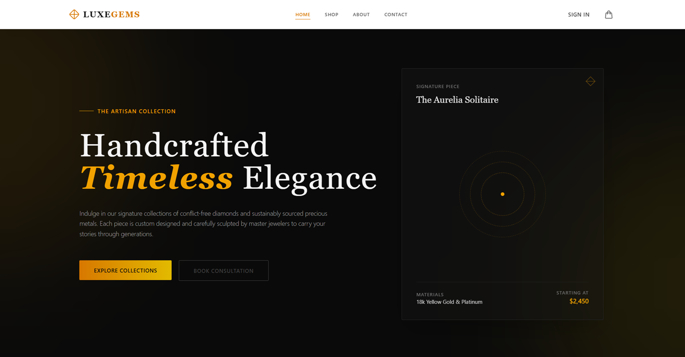
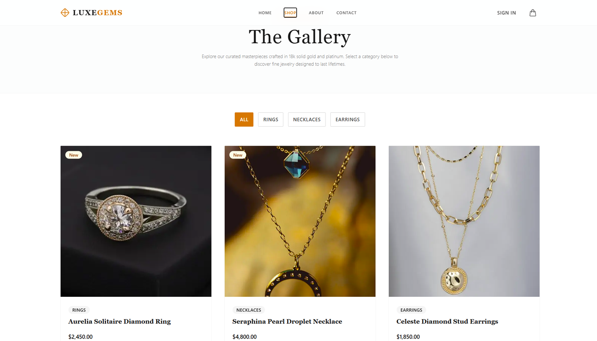
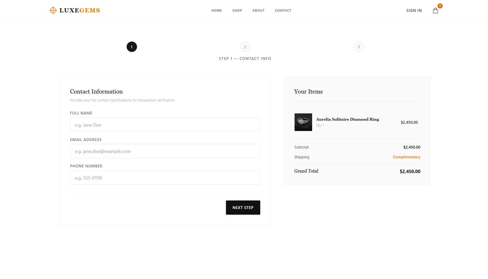
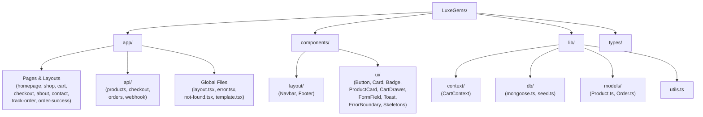
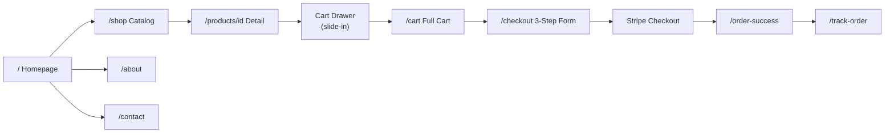
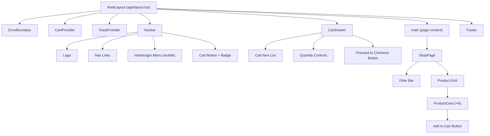
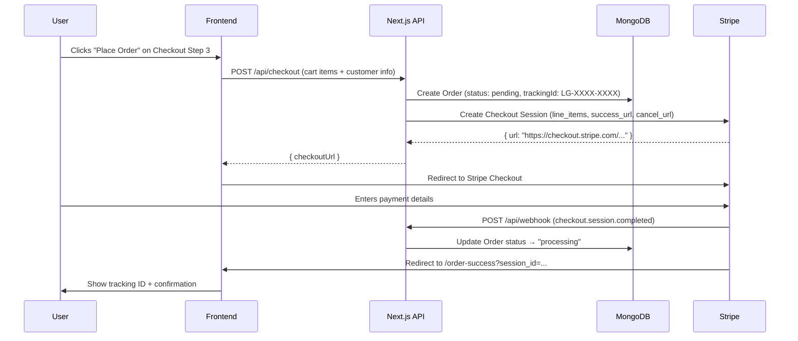
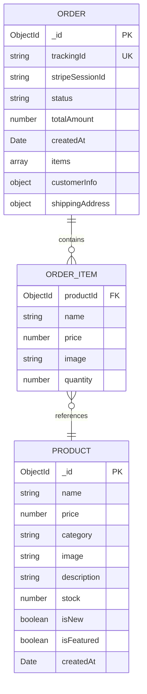
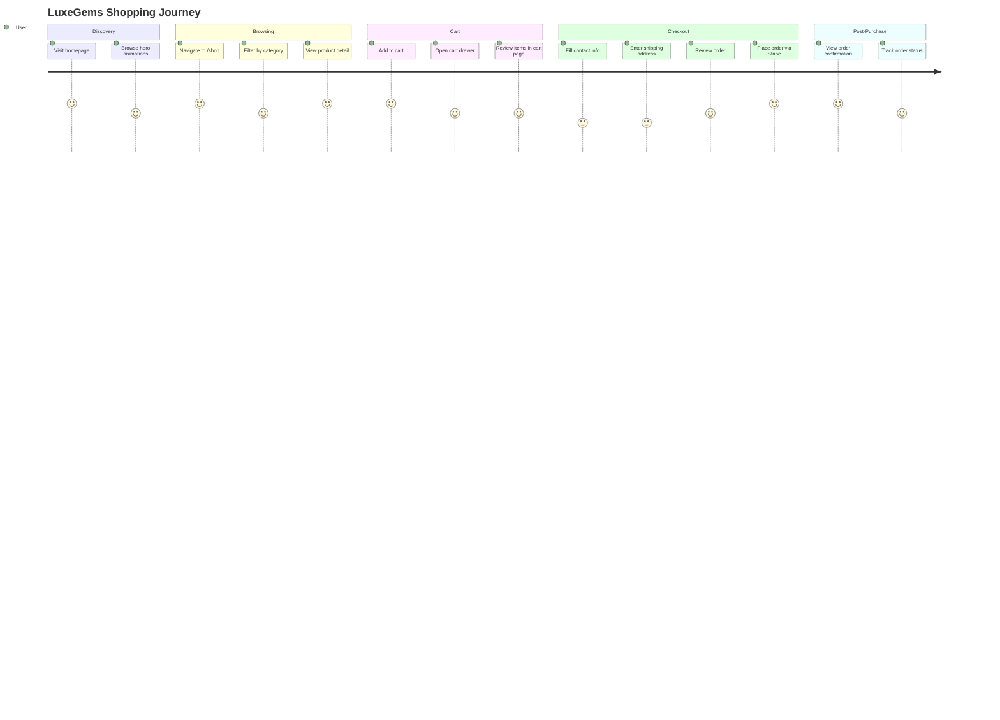

<!--
  📁 README.md
  📁 Main documentation for LuxeGems Store — Version 1.0.0
  ⚙️ Full setup guide, architecture diagrams, routes, and project overview.
-->

# LuxeGems Store

**LuxeGems Store** is a production-ready, full-stack jewelry e-commerce platform built with Next.js 14 App Router, MongoDB, Stripe payments, and Framer Motion animations. It delivers an immersive, premium shopping experience from product browsing through order tracking.





> 🚀 **Live Demo**: https://www.luxegems.kpebble.com

---

### Tech Stack Badges


---

## Feature Summary

| Feature | Status |
|---|---|
| Animated Hero Section | ✅ |
| Product Catalog (API-driven) | ✅ |
| Category Filter | ✅ |
| Product Detail Page | ✅ |
| Cart Context (useReducer) | ✅ |
| Cart Drawer (slide-in) | ✅ |
| Full Cart Page (responsive) | ✅ |
| Multi-step Checkout (Zod + RHF) | ✅ |
| Stripe Payment Integration | ✅ |
| Stripe Webhook Handler | ✅ |
| MongoDB + Mongoose Models | ✅ |
| DB Seed Script (8 products) | ✅ |
| Order Tracking Page | ✅ |
| Visual Order Status Stepper | ✅ |
| About & Contact Pages | ✅ |
| EmailJS Contact Form | ✅ |
| Framer Motion Animations | ✅ |
| Next.js Image Optimization | ✅ |
| SEO Metadata (all routes) | ✅ |
| Loading Skeletons | ✅ |
| Global Error Boundary | ✅ |
| Custom 404 Page | ✅ |
| Mobile-Responsive Navbar | ✅ |

---

## Quick Start

### Prerequisites
- **Node.js** 20.x or later
- **MongoDB** (local or [MongoDB Atlas](https://cloud.mongodb.com) free tier)
- **Stripe** account ([free test mode](https://stripe.com))
- **EmailJS** account ([free tier](https://www.emailjs.com)) *(optional — contact form only)*

### Step-by-Step Setup

```bash
# 1. Clone the repository
git clone https://github.com/nandakumar-nandu/LuxeGems.git
cd LuxeGems

# 2. Install all dependencies
npm install

# 3. Set up environment variables
cp .env.example .env
# → Open .env and fill in every value (see .env.example for instructions)

# 4. Start MongoDB (if running locally)
# macOS/Linux:
mongod --dbpath /data/db
# Windows: MongoDB runs as a service after installation

# 5. Seed the database with sample jewelry products
npx ts-node --project tsconfig.json -e "import('./lib/db/seed').then(m => m.seedProducts())"
# OR with tsx:
npx tsx lib/db/seed.ts

# 6. Start the development server
npm run dev

# 7. Open in your browser
open http://localhost:3000
```

### Test Stripe Payments Locally

```bash
# Install Stripe CLI
# https://stripe.com/docs/stripe-cli

# Login
stripe login

# Forward webhooks to your local dev server
stripe listen --forward-to localhost:3000/api/webhook

# Copy the webhook signing secret printed in the terminal → paste into STRIPE_WEBHOOK_SECRET in .env
```

Use Stripe test card `4242 4242 4242 4242` with any future expiry and any CVC.

---

## Folder Structure

```text
LuxeGems/
├── app/                          # Next.js App Router — all pages and layouts
│   ├── layout.tsx                # Root layout: fonts, Navbar, Footer, ErrorBoundary
│   ├── page.tsx                  # Homepage — animated hero section
│   ├── template.tsx              # Page transition fade wrapper
│   ├── error.tsx                 # Global error boundary page
│   ├── not-found.tsx             # Custom 404 page
│   ├── about/
│   │   ├── layout.tsx            # SEO metadata for About
│   │   └── page.tsx              # Brand story, values, team
│   ├── cart/
│   │   ├── layout.tsx            # SEO metadata (noindex)
│   │   └── page.tsx              # Full cart page (responsive table/card)
│   ├── checkout/
│   │   ├── layout.tsx            # SEO metadata (noindex)
│   │   └── page.tsx              # 3-step checkout form (Zod + RHF)
│   ├── contact/
│   │   ├── layout.tsx            # SEO metadata for Contact
│   │   └── page.tsx              # Contact form (EmailJS)
│   ├── order-success/
│   │   ├── layout.tsx            # SEO metadata (noindex)
│   │   └── page.tsx              # Order confirmation + tracking ID
│   ├── products/[id]/
│   │   ├── layout.tsx            # Dynamic SEO metadata (generateMetadata)
│   │   └── page.tsx              # Product detail — image, price, add to cart
│   ├── shop/
│   │   ├── layout.tsx            # SEO metadata for Shop
│   │   ├── loading.tsx           # Skeleton loading state
│   │   └── page.tsx              # Product catalog with category filters
│   ├── track-order/
│   │   ├── layout.tsx            # SEO metadata for Track Order
│   │   ├── loading.tsx           # Skeleton loading state
│   │   └── page.tsx              # Order tracking with status stepper
│   └── api/
│       ├── products/
│       │   ├── route.ts          # GET /api/products?category=&featured=
│       │   └── [id]/route.ts     # GET /api/products/:id
│       ├── checkout/route.ts     # POST — create Stripe session + pending order
│       ├── orders/[trackingId]/route.ts  # GET — look up order by tracking ID
│       └── webhook/route.ts      # POST — Stripe webhook handler
├── components/
│   ├── layout/
│   │   ├── Navbar.tsx            # Sticky navbar with hamburger mobile menu
│   │   └── Footer.tsx            # Footer with links and newsletter
│   └── ui/
│       ├── Badge.tsx             # Status pill tags
│       ├── Button.tsx            # Gold, outline, ghost variants
│       ├── Card.tsx              # Container panel
│       ├── CartDrawer.tsx        # Slide-in cart panel (Framer Motion)
│       ├── ErrorBoundary.tsx     # Class-based React error boundary
│       ├── FormField.tsx         # Labeled input with Zod error display
│       ├── OrderStatusSkeleton.tsx  # Loading skeleton for order tracking
│       ├── ProductCard.tsx       # Product card with hover animation
│       ├── ProductCardSkeleton.tsx  # Loading skeleton for catalog
│       └── Toast.tsx             # Toast notification system
├── lib/
│   ├── context/CartContext.tsx   # Cart state (useReducer), CartProvider
│   ├── db/
│   │   ├── mongoose.ts           # MongoDB connection with caching
│   │   └── seed.ts               # 8 sample jewelry products seeder
│   ├── models/
│   │   ├── Order.ts              # Mongoose Order schema
│   │   └── Product.ts            # Mongoose Product schema
│   └── utils.ts                  # cn(), formatPrice()
├── types/index.ts                 # Shared TypeScript interfaces
├── .env.example                   # Environment variable template
├── .env                           # Local secrets (gitignored)
├── CHANGELOG.md                   # Version history
├── SCREENTOUR.md                  # Screen-by-screen UI documentation
└── WALKTHROUGH.md                 # Technical implementation walkthrough
```

---

## App Routes

| Route | Type | Description |
|---|---|---|
| `/` | Static | Homepage — hero section |
| `/shop` | Client | Product catalog with category filters |
| `/products/[id]` | Dynamic | Product detail page |
| `/cart` | Client | Full cart page |
| `/checkout` | Client | 3-step checkout form |
| `/order-success` | Client | Order confirmation + tracking ID |
| `/track-order` | Client | Order status lookup |
| `/about` | Static | Brand story and team |
| `/contact` | Client | Contact form (EmailJS) |
| `/api/products` | Dynamic API | GET all products, optional filters |
| `/api/products/[id]` | Dynamic API | GET single product |
| `/api/checkout` | Dynamic API | POST — create Stripe session |
| `/api/orders/[trackingId]` | Dynamic API | GET order by tracking ID |
| `/api/webhook` | Dynamic API | Stripe webhook receiver |

---

## Architecture Diagrams

### Folder Architecture


### App Routes Flowchart


### Component Hierarchy


### Payment Sequence Diagram


### Database ER Diagram


### User Journey Diagram


---

## Lighthouse Score Targets

These targets were established after the Commit 9 image and SEO optimizations.

| Page | Performance | Accessibility | Best Practices | SEO |
|------|-------------|---------------|----------------|-----|
| `/` (Homepage) | ≥ 90 | ≥ 95 | ≥ 95 | 100 |
| `/shop` | ≥ 85 | ≥ 95 | ≥ 90 | 100 |
| `/products/[id]` | ≥ 85 | ≥ 95 | ≥ 90 | 100 |
| `/about` | ≥ 90 | ≥ 95 | ≥ 95 | 100 |
| `/contact` | ≥ 90 | ≥ 95 | ≥ 95 | 100 |
| `/track-order` | ≥ 85 | ≥ 90 | ≥ 90 | 100 |

### Key Optimizations Applied

| Optimization | Lighthouse Impact |
|---|---|
| `<Image>` with `fill` + `sizes` | Reduces LCP; eliminates oversized image downloads |
| `<Image priority>` on LCP hero | Removes render-blocking delay on product hero photo |
| WebP/AVIF via `remotePatterns` | 30–50% smaller image file sizes |
| Skeleton loading states | Eliminates Cumulative Layout Shift (CLS) |
| Per-route metadata layouts | Unique title/description → better click-through from search |
| `robots: noindex` on cart/checkout | Protects crawl budget |
| `generateMetadata` on product pages | Per-product Google Shopping indexing |

```bash
# Run Lighthouse locally against production build:
npm run build
npx serve .next -l 3000
npx lighthouse http://localhost:3000 --view
```

> **Note**: Always run Lighthouse against `npm run build`, not the dev server.

---

## Deployment (Vercel)

```bash
# 1. Push to GitHub
git push origin main

# 2. Import repository at https://vercel.com/new
# 3. Add all environment variables from .env to Vercel Dashboard → Settings → Environment Variables
# 4. Set NEXT_PUBLIC_APP_URL to your Vercel deployment URL
# 5. Add your Vercel URL as a Stripe webhook endpoint in the Stripe Dashboard
# 6. Deploy!
```

---

## What Is Coming Next

Future planned improvements (post-v1.0.0):
- User Authentication (Next-Auth or Clerk)
- Admin dashboard for order and product management
- Wishlist / Favorites functionality
- Product reviews and ratings
- Search with Algolia or MongoDB text search
