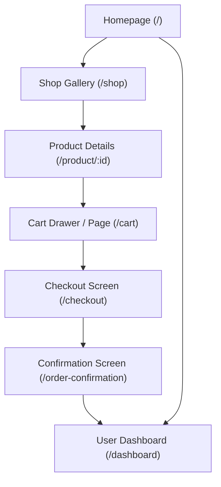

# Screentour & UI Navigation

This document details the interface layouts of LuxeGems Store, current mockups, and planned views as the customer navigates through the catalog, shopping cart, checkout, and member dashboards.

---

## Current Screens

### Homepage / Hero Section
- **Description**: The storefront's primary landing view. Built with a sleek dark slate background, warm glowing gold ambient lighting elements, and a dual-column layout.
- **Layout Outline**:
  - **Navbar**: Logo ("LuxeGems" with golden diamond), category links, and checkout cart badge.
  - **Left Section**: Bold Serif headline ("Handcrafted Timeless Elegance"), descriptive subtitle, primary gold Call-to-Action button ("Explore Collections"), and secondary outline button ("Book Consultation").
  - **Right Section**: A visual blueprint preview box outlining a blueprint circular sketch of the "Aurelia Solitaire" diamond ring, metal materials, and base pricing details.
  - **Footer**: Brand description, quick collections list, customer support directory, and newsletter signup wrapper.

### Shop Page / Product Gallery
- **Description**: A visual collection gallery displaying LuxeGems' catalog of fine jewelry. Includes an interactive category filter bar and a highly responsive grid of products.
- **Layout Outline**:
  - **Banner Header**: Small tag ("Exclusive Catalog"), a large elegant serif title ("The Gallery"), and a brief introduction welcoming clients.
  - **Category Filter Bar**: A centered row of styling buttons ("All", "Rings", "Necklaces", "Earrings"). Active filters use a gold theme with charcoal text, while inactive buttons use thin neutral borders.
  - **Responsive Product Grid**: A 1-to-3 column grid (depending on screen size) containing 6 mock product objects.
  - **Card Anatomy**:
    - **Image Container**: A square aspect ratio image that zooms smoothly on hover.
    - **Badge Overlays**: High-contrast gold badges indicating "New" arrivals.
    - **Category Label**: Small neutral tag mapping the jewelry type.
    - **Product Name**: Displayed using a premium serif font that turns golden amber on card hover.
    - **Price Tag**: Clean, bold pricing formatted using currency helpers.
    - **Action Button**: A full-width "Add to Cart" button with a light hover outline effect.

---

## Planned Screens (🚧 Coming Soon)

### 🚧 Catalog Collections View (Advanced Features)
- Side panels containing filtering options (price range, metal type, gemstone).
- Order sort dropdown menus (Price Low-to-High, Newest).
- Dynamic paginated loading.

### 🚧 Product Detail Screen
- Multi-image zoom gallery displaying high-quality product images.
- Choice options for metal selections (18k Gold, Platinum) and ring size selectors.
- Rich tabs detailing materials, conflict-free verification certificates, and shipping timelines.

### 🚧 Shopping Cart Drawer / Page
- A slide-over panel displaying chosen items, pricing, and selected configurations.
- Subtotal tallies and discount code entry boxes.

### 🚧 Checkout Portal
- A checkout form collecting shipping addresses, email contact, and payment fields using Stripe Elements.

### 🚧 Success Page / Invoice receipt
- Visual order success checkmarks, order ID, shipping estimates, and summaries.

### 🚧 User Profile & Orders View
- Historic orders listings, shipment trackers, and personal credentials editors.

---

## Screen Connection Architecture
This flowchart maps the primary screens and their entry points:

