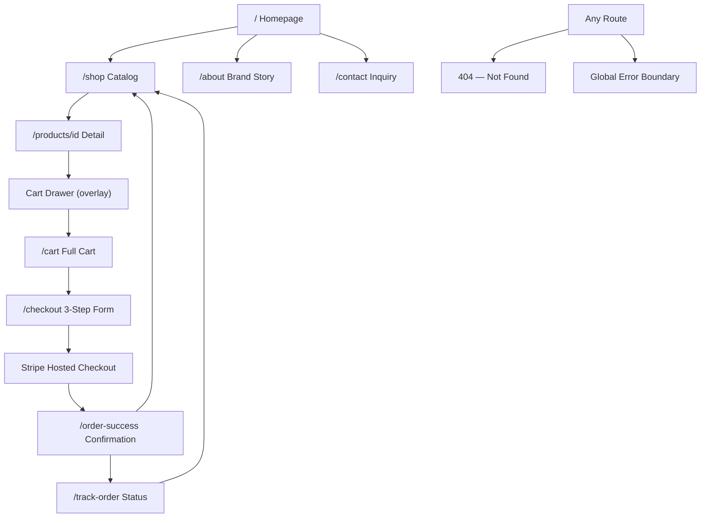

# LuxeGems — Screen Tour & UI Navigation Guide

This document describes every screen in the LuxeGems Store: what the user sees, what actions are available, what happens after each action, and how edge cases are handled.

---

## Screen Connection Architecture

---

## 1. Homepage (`/`)

### What the User Sees
- Full-screen dark hero section (`bg-neutral-950`) with warm gold ambient glow effects
- **Left column**: Animated stacked content — gold eyebrow tag ("The Artisan Collection"), serif headline ("Handcrafted Timeless Elegance"), descriptive body text, two CTA buttons
- **Right column** *(desktop only)*: Abstract "Aurelia Solitaire" blueprint card with a rotating dashed ring diagram, material details, and a starting price
- Sticky Navbar (logo + nav links + cart badge)
- Footer with brand info, quick links, and newsletter placeholder

### Available Actions
| Action | What Happens |
|---|---|
| Click "Explore Collections" | Navigates to `/shop` |
| Click "Book Consultation" | Navigates to `/contact` |
| Click cart bag icon | Opens CartDrawer from the right |
| Click logo | Reloads `/` |
| Click hamburger (mobile) | Drops down full-screen nav links |

### Edge Cases
- **No animation support**: Framer Motion degrades gracefully — layout remains valid even if JS fails to load animations
- **Mobile**: Hero right-column card is hidden (`hidden lg:block`); single-column text layout centered

---

## 2. Navigation Bar (Global)

### What the User Sees
- Sticky header with glassmorphism blur (`bg-white/80 backdrop-blur-md`)
- Logo with diamond SVG icon (rotates 45° on hover)
- Navigation links: Home, Shop, About, Contact — active link has amber underline
- "Sign In" ghost button *(hidden on mobile)*
- Shopping bag icon with cart count badge *(badge hidden when count is 0)*
- **Mobile**: Hamburger `☰` icon replaces nav links

### Available Actions
| Action | What Happens |
|---|---|
| Click nav link | Navigates to that page; active link gets amber underline |
| Click cart bag | Opens CartDrawer overlay |
| Click "Sign In" | Placeholder — no auth yet |
| Click hamburger (mobile) | Toggles dropdown nav menu open/closed |
| Click any mobile nav link | Navigates and closes the mobile menu |

### Edge Cases
- **Cart badge**: Only appears when `totalCartItems > 0`; shows "9+" when count exceeds 9
- **Active link detection**: Uses `pathname.startsWith(link.href)` so `/shop/anything` also highlights the Shop link

---

## 3. Shop / Catalog Page (`/shop`)

### What the User Sees
- Page header: "The Gallery" serif heading with category filter bar below
- Filter buttons: All, Rings, Necklaces, Earrings — active filter has gold fill
- Responsive product grid: 1 column (mobile) → 2 columns (sm) → 3 columns (lg)
- Each **ProductCard** shows: product image (with zoom-on-hover), "New" badge if `isNew`, category tag, product name, price, and "Add to Cart" button
- **Loading state**: 6 `ProductCardSkeleton` cards are shown while data is fetching
- **Error state**: Red error banner with "Retry Load" button if API call fails

### Available Actions
| Action | What Happens |
|---|---|
| Click filter button | Sets active filter; triggers API call with `?category=` param; re-renders grid |
| Click product image or name | Navigates to `/products/[id]` |
| Click "Add to Cart" | Adds item to cart; cart badge increments; brief visual confirmation |

### Edge Cases
| Edge Case | Behavior |
|---|---|
| No products in category | Empty state shown with "No jewelry found" and a suggestion to browse All |
| API timeout / DB offline | Error banner with retry button; falls back to local file DB |
| Network error on filter | Previous results remain displayed while error is shown |

---

## 4. Product Detail Page (`/products/[id]`)

### What the User Sees
- Breadcrumb navigation: All Products → [Category] → [Product Name]
- Two-column layout (stacks on mobile):
  - **Left**: Large product image with `priority` loading; "New Edition" badge if applicable
  - **Right**: Category tag, product name, price, in-stock status indicator, description, quantity stepper, "Add to Cart" button
- "You May Also Like" section below — 3 same-category products in a card grid

### Available Actions
| Action | What Happens |
|---|---|
| Adjust quantity stepper | Increments/decrements quantity (min 1) |
| Click "Add to Cart" | Adds `quantity` units to cart context; shows CartDrawer briefly |
| Click related product | Navigates to that product's detail page |
| Click breadcrumb | Navigates back to catalog or category |

### Edge Cases
| Edge Case | Behavior |
|---|---|
| Product not found (`404`) | Renders custom `not-found.tsx` — "Masterpiece Not Found" page |
| Stock = 0 | "Out of Stock" badge shown; Add to Cart button disabled |
| Stock ≤ 3 | "Only X left" amber warning badge shown |
| API error | Error boundary catches and renders fallback UI with retry option |

---

## 5. Cart Drawer (Overlay)

### What the User Sees
- Slides in from the right using Framer Motion `x: "100%"` → `x: 0`
- Dark semi-transparent backdrop overlay closes the drawer on click
- **Header**: "Your Cart" title + close (×) button
- **Item list**: Scrollable; each item shows image thumbnail, name, unit price, quantity `−`/`+` controls, line total, and remove button (trash icon)
- **Footer**: Subtotal, "Proceed to Checkout" gold button, "Continue Shopping" link
- **Empty state**: Shopping bag icon + "Your cart is empty" + "Explore Collections" button

### Available Actions
| Action | What Happens |
|---|---|
| Click `−` | Decrements quantity; if quantity reaches 0, removes item |
| Click `+` | Increments quantity; updates subtotal |
| Click trash icon | Removes item from cart; drawer re-renders |
| Click backdrop | Closes drawer |
| Click `×` | Closes drawer |
| Click "Proceed to Checkout" | Closes drawer; navigates to `/checkout` |
| Click "Continue Shopping" | Closes drawer; user stays on current page |

### Edge Cases
| Edge Case | Behavior |
|---|---|
| Remove last item | Cart transitions to empty state immediately |
| Quantity reduced to 0 | Item is automatically removed (enforced in reducer) |

---

## 6. Full Cart Page (`/cart`)

### What the User Sees
- **Mobile**: Responsive card layout — each item is a horizontal card with image, name, price, quantity controls, total, and remove button
- **Desktop**: Traditional table layout — columns for Product, Quantity, Price, Total
- **Order Summary sidebar**: Subtotal, Complimentary shipping tag, Estimated Tax (placeholder), Grand Total
- Two action buttons: "Proceed to Checkout" (gold) and "Continue Shopping" (outline)
- **Empty cart state**: Illustrated empty bag icon with "Your Cart Is Empty" message and "Explore Collections" button

### Available Actions
| Action | What Happens |
|---|---|
| Quantity controls | Same as CartDrawer — live updates subtotal |
| Remove item | Removes item; sidebar totals recalculate |
| "Proceed to Checkout" | Navigates to `/checkout` |
| "Continue Shopping" | Navigates back to `/shop` |

### Edge Cases
| Edge Case | Behavior |
|---|---|
| All items removed | Page transitions to empty state with "Explore Collections" CTA |
| Cart is already empty on load | Empty state rendered immediately |

---

## 7. Checkout Page (`/checkout`)

### What the User Sees
- **Step indicator**: 3 circles numbered 1-2-3 with connecting line:
  - Completed steps → green checkmark circle
  - Active step → dark filled circle with ring halo
  - Future steps → light grey circle
  - Mobile: labels hidden; active step name shown below the indicator as text
- **Step 1 — Contact Information**: Name, Email, Phone inputs with Zod validation
- **Step 2 — Shipping Address**: Street, City, State/Province, ZIP/Postal, Country
- **Step 3 — Review Order**: Read-only summary of all entered data + itemized order list + grand total + "Place Order" gold button
- **Order Summary sidebar** *(desktop only)*: Scrollable list of cart items with thumbnails + running totals
- **Full-page loader**: Spinning gold logo + "Preparing secure checkout portal..." during Stripe redirect

### Available Actions
| Action | What Happens |
|---|---|
| Fill field + click "Next Step" | Validates current step; advances to next if valid |
| Click "Back" | Returns to previous step without clearing data |
| Click "Place Order" (Step 3) | POSTs to `/api/checkout`; redirects to Stripe Checkout |
| Click "Continue Shopping" link | Navigates to `/shop` (abandons checkout) |

### Edge Cases
| Edge Case | Behavior |
|---|---|
| Invalid email format | Zod error shown inline below the field |
| Phone < 10 chars | Inline error shown |
| Empty cart at checkout | Redirects to `/cart` with a warning |
| Stripe API error | Error toast shown; loader dismissed; user can retry |

---

## 8. Stripe Checkout (External)

### What the User Sees
- Stripe-hosted checkout page at `https://checkout.stripe.com/...`
- LuxeGems branding, product line items, and secure card input fields

### Available Actions
| Action | What Happens |
|---|---|
| Enter test card `4242 4242 4242 4242` + submit | Payment succeeds; redirected to `/order-success` |
| Click "Cancel" | Redirected back to `/checkout` step 3 |

---

## 9. Order Success Page (`/order-success`)

### What the User Sees
- Animated checkmark (Framer Motion scale-in)
- "Order Confirmed" serif heading
- "Your masterpiece is being crafted with care" subtitle
- Unique tracking ID in a highlighted box (format: `LG-XXXX-XXXX`)
- Two buttons: "Track Your Order" and "Return to Boutique"

### Available Actions
| Action | What Happens |
|---|---|
| Click "Track Your Order" | Navigates to `/track-order?id=LG-XXXX-XXXX` with ID pre-filled |
| Click "Return to Boutique" | Navigates to `/shop` |

### Edge Cases
| Edge Case | Behavior |
|---|---|
| Page loaded without session | Shows generic success message without tracking ID |

---

## 10. Order Tracking Page (`/track-order`)

### What the User Sees
- Search bar: "Enter your tracking ID" input + gold "Track Order" button
- If order found: **4-step status stepper** (Order Placed → Processing → Shipped → Delivered), order items list, customer info card, shipping address card
- **Loading state**: `OrderStatusSkeleton` placeholder while API fetches

### Order Status Stepper States
| Status | Active Steps |
|---|---|
| `pending` | Step 1 only (Order Placed) |
| `processing` | Steps 1-2 |
| `shipped` | Steps 1-3 |
| `delivered` | All 4 steps |
| `failed` | Step 1 shown with red "Payment Failed" indicator |

### Available Actions
| Action | What Happens |
|---|---|
| Enter tracking ID + click "Track" | Calls `/api/orders/[trackingId]`; renders order details |
| Click "Return to Shop" | Navigates to `/shop` |

### Edge Cases
| Edge Case | Behavior |
|---|---|
| Invalid/unknown tracking ID | "Order not found" error message shown; input cleared |
| Empty tracking ID submitted | Validation error: "Please enter a tracking ID" |
| API error | Error message shown with "Try Again" option |
| URL param `?id=LG-XXXX-XXXX` on load | Auto-populates input and triggers search |

---

## 11. About Page (`/about`)

### What the User Sees
- Dark legacy banner hero section with animated title
- Two-column split: brand story text + artisan studio photo
- "Our Core Convictions" grid: 3 value cards (Ethical Sourcing, Artisanal Craft, Circular Luxury)
- "The Creative Team" grid: 3 circular team member portraits with grayscale-to-color hover effect

### Available Actions
| Action | What Happens |
|---|---|
| Hover team portrait | Grayscale filter fades away to reveal full-color image |
| Scroll down | Framer Motion `whileInView` animations trigger on each section |

---

## 12. Contact Page (`/contact`)

### What the User Sees
- Two-column layout: Left info panel (address, email, phone, hours) + Right inquiry form
- Form fields: Name, Email, Subject, Message textarea
- Gold "Submit Inquiry" button
- Toast notification on success or failure

### Available Actions
| Action | What Happens |
|---|---|
| Fill form + click "Submit Inquiry" | Validates with Zod; sends via EmailJS (or simulates if key missing); shows success toast |
| Submit with invalid email | Inline validation error shown below email field |
| Submit empty form | All required field errors shown simultaneously |

### Edge Cases
| Edge Case | Behavior |
|---|---|
| EmailJS keys not set | 1.5s simulated delay; success toast still shown in demo mode |
| EmailJS API error | Error toast shown: "Message could not be sent. Please try again." |

---

## 13. Loading States

| Page | Loading Component | Behavior |
|---|---|---|
| `/shop` | 6 × `ProductCardSkeleton` | Pulsating grey cards in the product grid |
| `/track-order` | `OrderStatusSkeleton` | Pulsating placeholders for stepper, items, and address |
| Any route | Next.js `loading.tsx` | Auto-shown during async navigation |

---

## 14. Error States

### Global Error Boundary
- Triggered when any child component throws a runtime error
- Shows "Concierge Interrupted" branded screen
- **Actions**: "Retry" (resets error state) or "Return Home" (href to `/`)
- In development mode: shows the raw error message in a red code block

### Custom 404 Page (`/not-found.tsx`)
- Shows "Masterpiece Not Found" with diamond icon
- Description: "The piece you're looking for has moved or doesn't exist"
- **Action**: "Return to the Boutique" button → navigates to `/shop`

---

## 15. Mobile Responsiveness Summary

| Page | Mobile Adaptation |
|---|---|
| Navbar | Hamburger `☰` menu — dropdown nav replaces horizontal links |
| Homepage | Single column; right-column blueprint card hidden |
| Shop | 1-column product grid |
| Cart | Card layout replaces table; summary sidebar stacks below items |
| Checkout | Step labels hidden; active step name shown as text below indicator |
| Product Detail | Single column; image full-width above info |
| About | Single column; team and values grids stack |
| Contact | Single column; info panel stacks above form |
| Track Order | Single column; details panel stacks |
