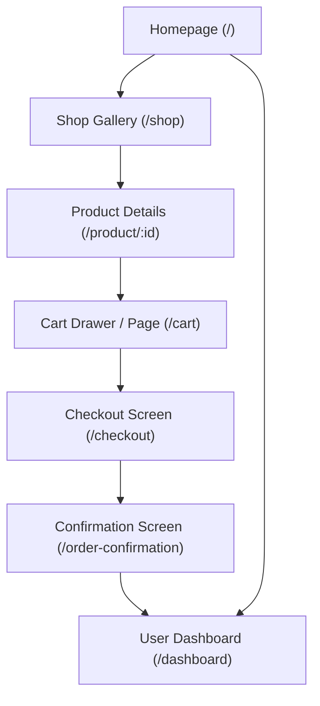

# Screentour & UI Navigation

This document details the interface layouts of LuxeGems Store, current mockups, and planned views as the customer navigates through the catalog, shopping cart, checkout, and member dashboards.

---

## Current Screens

### Homepage / Hero Section
- **Description**: The storefront's primary landing view. Built with a sleek dark slate background, warm glowing gold ambient lighting elements, and a dual-column layout.
- **Layout Outline**:
  - **Navbar**: Logo ("LuxeGems" with golden diamond), category links, and checkout cart badge.
  - **Left Section**: Bold Serif headline ("Handcrafted Timeless Elegance"), descriptive subtitle, primary gold Call-to-Action button ("Explore Collections"), and secondary outline button ("Book Consultation").
  - **Right Section**: A visual blueprint preview box outlining a blueprint circular sketch of the "Aurelia Solitaire" diamond ring, metal materials, and base pricing details.
  - **Footer**: Brand description, quick collections list, customer support directory, and newsletter signup wrapper.

### Shop Page / Product Gallery
- **Description**: A visual collection gallery displaying LuxeGems' catalog of fine jewelry. Includes an interactive category filter bar and a highly responsive grid of products.
- **Layout Outline**:
  - **Banner Header**: Small tag ("Exclusive Catalog"), a large elegant serif title ("The Gallery"), and a brief introduction welcoming clients.
  - **Category Filter Bar**: A centered row of styling buttons ("All", "Rings", "Necklaces", "Earrings"). Active filters use a gold theme with charcoal text, while inactive buttons use thin neutral borders.
  - **Responsive Product Grid**: A 1-to-3 column grid (depending on screen size) containing 6 mock product objects.
  - **Card Anatomy**:
    - **Image Container**: A square aspect ratio image that zooms smoothly on hover.
    - **Badge Overlays**: High-contrast gold badges indicating "New" arrivals.
    - **Category Label**: Small neutral tag mapping the jewelry type.
    - **Product Name**: Displayed using a premium serif font that turns golden amber on card hover.
    - **Price Tag**: Clean, bold pricing formatted using currency helpers.
    - **Action Button**: A full-width "Add to Cart" button with a light hover outline effect.

### Cart Drawer (Shopping Cart panel)
- **Description**: A slide-over side panel that slides in from the right when the cart icon is clicked. Allows users to view and edit cart items, quantities, and see computed subtotals.
- **Layout Outline**:
  - **Dark Backdrop Screen Overlay**: A dark semi-transparent layer that covers the storefront, focusing attention on the cart drawer (closes the drawer on click).
  - **Drawer Container**: Fixed vertical sidebar utilizing light shadows, clean padding, and a border structure.
  - **Drawer Header**: Displays a simple serif title ("Your Cart") and a top-right close (X) icon button.
  - **Scrollable Item Workspace**: Displays a list of selected jewelry items:
    - **Image Thumbnail**: A small rectangular product image.
    - **Title & Subtotal**: Displays the handcrafted product title alongside its calculated line item price.
    - **Quantity Incrementors**: Responsive `-` and `+` outline buttons allowing clients to modify product quantities in real time.
    - **Remove Action**: An explicit trash icon allowing users to discard individual items entirely.
  - **Subtotal Tally Panel**: A fixed footer area that tallies the pricing total of all selected items using currency formatters.
  - **Checkout Button**: A prominent gold gradient button ("Proceed to Checkout") indicating checkout progression.
  - **Empty State Workspace**: A visual fallback showing a shopping bag icon, an empty cart reminder, and a "Continue Shopping" button.

### Cart Page (/cart)
- **Description**: A full-page tabular layout of selected products, providing cart adjustment capabilities and order calculations.
- **Layout Outline**:
  - **Tabular Items Workspace**: A border-separated table containing:
    - **Product Details**: Primary product thumbnail, product name, and an inline "Remove" text link with a trash icon.
    - **Quantity Box**: Centered count adjusters (`-` and `+` outline triggers) to modify quantities.
    - **Price Column**: Unit price of the piece formatted via helpers.
    - **Line Total Column**: Total price calculated for the line item (Unit Price * Quantity).
  - **Order Summary Sidebar**:
    - Subtotal calculation, complimentary shipping tag, and calculated order total.
    - **Proceed to Checkout Button**: A wide gold gradient action button leading to `/checkout`.
    - **Continue Shopping Button**: An outline button directing back to `/shop`.
  - **Empty Cart visual fallback**: An elegant shopping bag outline overlaying collection return instructions when items list is empty.

### Checkout Steps (/checkout)
- **Description**: A clean multi-step checkout form flow verified by react-hook-form inputs and Zod validations. Contains a step indicator tracking current input panels.
- **Step Layout & Controls**:
  - **Horizontal Step Tracker**: Renders circle digits ("1 Contact Info", "2 Shipping", "3 Review Order") highlighting the active step with dark outlines and completed steps with green success circles.
  - **Panel 1: Contact Specs**: Labeled inputs (Full Name, Email Address, Phone Number) using custom FormField templates. Validates format syntax upon stepping forward.
  - **Panel 2: Shipping Destination**: Street address, city, state, ZIP, and country fields. Validates length requirements to ensure accurate delivery specs.
  - **Panel 3: Order Review**:
    - Displays static review text cards containing step 1/2 inputs (Full Name, Email, Phone, Address).
    - Lists selected checkout items from the basket context alongside calculated grand totals.
    - **Navigation Triggers**: Displays outline "Back" buttons and primary "Next Step" buttons. Step 3 displays a gold gradient "Place Order" button.
  - **Processing Checkout Indicator**: A full-page visual spin loader saying "Preparing secure checkout portal..." which is active while POSTing order details.

### Product Filtering Use Case
- **Description**: Explains the client workflow for filtering fine jewelry catalog items by category.
- **Workflow & Layout Outline**:
  - **Category Selectors**: The user clicks a category selector in the filter bar (e.g. "Rings").
  - **State Highlights**: The selected selector immediately transitions to a filled gold highlight background while others revert to outline borders.
  - **Dynamic Loading Trigger**: The interface displays a revolving gold spinner and initiates a backend request (`/api/products?category=Rings`).
  - **Grid Re-rendering**: The product card grid refreshes to display only items matching the queried category.
  - **Error Fallback**: If connection to the database fails, the grid is replaced by a warning prompt with a "Retry Load" button to reload the active filter.

### Checkout Payment (Stripe Checkout Hosted Gateway)
- **Description**: The secure external payment portal hosted by Stripe (or simulated redirect locally).
- **Layout Outline**:
  - **Left Section**: Displays the LuxeGems store logo, purchased line items list (descriptions, quantities, images), and final subtotal.
  - **Right Section**: Secure credit card input fields (Card number, Expiration, CVC, Name on card) and Billing Address fields.
  - **CTA Trigger**: A dark pay button that initiates real-time authorization checks and redirects the user back to the store.

### Order Success Page (/order-success)
- **Description**: The final presentation page confirming payment success and displaying tracking codes.
- **Layout Outline**:
  - **Visual Success Accent**: A green circle outline with a checkmark indicating purchase victory.
  - **Title Serif**: "Order Confirmed" heading.
  - **Fulfillment Tracking Panel**: A light grey highlight box displaying a unique tracking code (format: `LG-XXXX-XXXX`) inside a copy-paste dashed border frame.
  - **Action buttons**:
    - **Track Your Order Button**: A solid gold gradient button (fires an alert placeholder).
    - **Return to Storefront Button**: An outline button directing the customer back to the `/shop` gallery.

---

## Planned Screens (🚧 Coming Soon)

### 🚧 Catalog Collections View (Advanced Features)
- Side panels containing filtering options (price range, metal type, gemstone).
- Order sort dropdown menus (Price Low-to-High, Newest).
- Dynamic paginated loading.

### 🚧 Product Detail Screen
- Multi-image zoom gallery displaying high-quality product images.
- Choice options for metal selections (18k Gold, Platinum) and ring size selectors.
- Rich tabs detailing materials, conflict-free verification certificates, and shipping timelines.

### 🚧 User Profile & Orders View
- Historic orders listings, shipment trackers, and personal credentials editors.

---

## Screen Connection Architecture
This flowchart maps the primary screens and their entry points:

