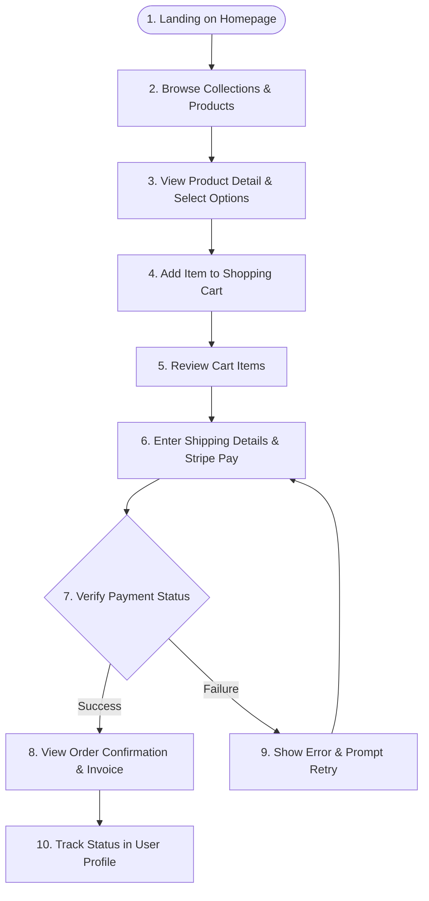

# Walkthrough & User Journey

Welcome to the LuxeGems Store walkthrough. This document outlines the overall user walkthrough, planned features, and a diagram showing how a customer navigates the jewelry e-commerce experience.

---

## Project Overview
LuxeGems Store is designed to provide clients with a premium digital salon where they can browse luxurious handcrafted jewelry, customize stones and sizes, manage a dynamic shopping cart, make secure purchases via Stripe, and track their order status in a personalized dashboard.

---

## Planned Features

### 🚧 Catalog & Filtering (Coming Soon)
- Dynamic browsing of Collections, Rings, Necklaces, and Earrings.
- Filter catalog by metal type (Gold, Platinum), price range, and gemstone.
- Dynamic search bar matching product names and descriptions.

### 🚧 Cart & Checkout (Coming Soon)
- Full client-side cart states allowing additions, quantity edits, and item removals.
- Integration of ring sizing selections.
- Persistent cart storage using local hooks.

- Secure credit card checkouts and webhook processing.

### 🚧 User Authentication (Coming Soon)
- Auth integration (credentials or passwordless login).
- Protected pages for order tracking and user settings.
- Administrator control panels.

### 🚧 Order Tracking Dashboard (Coming Soon)
- Display order status updates (Pending, Shipped, Delivered).
- View purchase histories and item lists.

---

## Planned User Journey Flowchart
This flowchart traces how a user interacts with the app from landing to final checkout confirmation:

---

## Shop / Product Gallery
Browsing the LuxeGems catalog begins on the Shop page (`/shop`), which displays our collection fetched dynamically from the MongoDB database:
1. **Interactive Filter Navigation**: The header of the page displays filter buttons for categories: *All*, *Rings*, *Necklaces*, and *Earrings*. Clicking these buttons dynamically queries the backend REST endpoints (e.g. `/api/products?category=Rings`), updating the gallery grid in real-time.
2. **Product Grid Layout**: Below the filter bar, products are laid out in a responsive grid mapping to our premium `ProductCard` atomic component.
3. **Dynamic API Fetching**: Connects to `/api/products` using Next.js revalidation cache controls, with integrated spin loaders and error retry fallbacks.
4. **Card Anatomy**:
   - **Visual Zoom Cover**: High-quality imagery that slightly zooms in when hovered (`group-hover:scale-105`), creating an engaging visual cue.
   - **Arrival Status Badge**: An elegant gold-themed "New" badge displayed for new products (`isNew` flag).
   - **Category Tag**: Describing the product type (e.g. Rings, Necklaces) using our atomic Badge.
   - **Serif Title**: Showing the handcrafted product name.
   - **Formatted Pricing**: Real-time dollar amount formatting using localized utilities.
   - **Add to Cart Action**: A custom button that triggers the addToCart context action and auto-opens the cart drawer.

---

## Cart Management
LuxeGems includes a global client-side cart manager powered by React Context and `useReducer`:
1. **Adding Items to Cart**: Clicking the "Add to Cart" button on any `ProductCard` triggers a dispatch action that adds the item details (ID, name, price, thumbnail image) to the global cart items array.
2. **Auto-Open Drawer Feedback**: Upon adding an item, the global state immediately opens the `CartDrawer` sliding over from the right side, giving instant visual confirmation to the client.
3. **Dynamic Header Cart Badge**: The Navbar features a shopping bag icon with a dynamic badge indicating the total count of items. This count increments instantly upon addition.
4. **Interactive Controls inside Drawer**:
   - **Quantity Increments & Decrements**: Consumable `updateQuantity` actions let users adjust counts directly with simple `+` and `-` triggers (clamping the minimum value to 1).
   - **Removing Items**: An explicit trash icon triggers `removeFromCart`, removing the chosen item entirely.
   - **Subtotal Tally**: Displays a sum total of the cart contents formatted using price utilities.
   - **Checkout Gateway Call**: A CTA button redirects clients to the full Cart page (`/cart`) or directly to the Checkout portal.
5. **Empty Cart Placeholder**: When empty, the drawer features a friendly visual prompt encouraging the user to continue browsing the shop gallery.

---

## Checkout Process
The checkout process utilizes a secure, multi-step validation form at `/checkout`:
1. **Validation Engine**: Backed by **React Hook Form** and **Zod** schema validations, ensuring all input fields match exact formats before letting clients progress to the next step.
2. **Step 1: Contact Info**:
   - Collects the user's Full Name, Email Address, and Phone Number.
   - Requires email validation rules (standard syntax) and phone digits limit validation.
3. **Step 2: Shipping Address**:
   - Gathers Street Address, City, State, ZIP/Postal Code, and Country.
   - Enforces completeness validations to prevent incomplete courier routing.
4. **Step 3: Review Order**:
   - Pulls in the current cart items list and subtotal summary from the cart context.
   - Summarizes entered contact info and shipping location details for final validation.
5. **Form Submission & Order Creation**:
   - Clicking "Place Order" runs form validations, formats the order payload, and POSTs details to the `/api/checkout` endpoint.
   - Clears the global in-memory cart using `clearCart()` and redirects the customer to the returned gateway URL.

---

## Payment Flow
1. **API Initialization**: When the checkout form on Step 3 is submitted, it POSTs the items and customer credentials payload to `/api/checkout`.
2. **Stripe Checkout Session**: The backend API initializes a Stripe Checkout Session using the card payment method type, listing item names and prices.
3. **Database Order Creation**: Saves a new Order record to MongoDB with status `Pending` and maps the `stripeSessionId` key.
4. **Client Redirect**: Returns `{ checkoutUrl: session.url }` back to the frontend. The client window location is dynamically updated to redirect the buyer to Stripe's payment gateway.
5. **Simulation Mode**: If Stripe credentials are not present in `.env`, the endpoint runs in Simulation Mode, immediately saving the order status as `Paid` and returning a redirect URL to `/order-success`.
6. **Webhook Lifecycle Confirmation**:
   - **checkout.session.completed**: Emitted when payment successfully clears. The `/api/webhook` listener verifies the signature using `STRIPE_WEBHOOK_SECRET` and marks order status as `Paid`.
   - **checkout.session.expired**: Emitted if checkout times out. Marks order status as `Failed`.

---

## Order Confirmation
1. **Redirect Success Route**: Following transaction completion, Stripe or simulation redirects the client to `/order-success?trackingId=LG-XXXX-XXXX`.
2. **Success Presentation**: The page reads the `trackingId` query parameter and displays an elegant confirmation message.
3. **Logistics Tracking ID**: The unique brand tracking code is presented inside a highlighted copy-paste container block.
4. **Fulfillment Navigation**: Features a "Track Your Order" action button.
